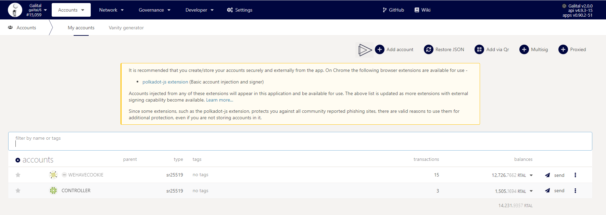

# Become a Kusari Validator


The following guide will teach you how to set up a Kusari Chain Validator. The process of becoming a validator requires two steps. The first step is to set up a network node. The second step is to assign your node to your account and apply for validator candidacy.

Network validators are the foundation of a decentralized proof-of-stake network because they are responsible for concluding on a consensus by creating new and validating already produced blocks. That said, network validators are the prime target for adversaries that aim to sabotage the network. The Smart Dex Chain has many layers to protect the network from attacks. The first layer is the security of each validator itself. Another layer is the slashing mechanism that detects validator nodes that display abnormal or dangerous behavior and punishes them with slashes. A slash will, in all cases, lead to the loss of funds. 

!!! warning
    Hence the warning: Running a validator on a live network is a lot of responsibility! You will be accountable for your stake and the stake of your current nominators. If you make a mistake and get slashed, your money and your reputation will be at risk. However, running a validator can also be very rewarding, knowing that you contribute to the security of a decentralized network while growing your stash.

## Setp 1 - Setup a Network Node

## Requirements

You can operate a network node on a local computer, a professional server-rig in your basement, or on a remotely hosted virtual private server (VPS) in the clouds. It's up to you to choose the infrastructure you feel most comfortable with. What doesn't change are the requirements of a network node that operates as a validator. Validators should always be online and powerful enough to create and validate the authoring process of new blocks. If your validator is failing at one of these requirements, it will get punished by slashes.

!!! tip
    The most common way for a beginner to run a validator is on a VPS running Linux. You may choose whatever VPS providers that you prefer. 

We benchmarked the transactions weights on the Kusari Chain Testnet on standard hardware. We recommend that validators run at least the standard hardware to ensure they can process all blocks in time. The following are not minimum requirements, but if you decide to run with less than this, beware that you might have a performance issue.

### Lower-end Hardware :

- 6GB ram, 60 GB Storage, 2 CPU , <strong>stable server uplink connection with fixed IP</strong>

### Ideal Hardware :

- 60GB ram, 300 GB Storage, 6 CPU, <strong>stable server uplink connection with fixed IP</strong>

!!! info
    Anything between the lower-end and ideal hardware should be sufficient to run a validator on the Smart Dex Chain testnet. 


## Using Ubuntu 20.04 : 

### Update your Ubuntu
```
sudo apt-get update
```

### Network Time Protocol (NTP) Client

We currently require that the clocks of all validators on the network stay reasonably in sync. The NTP client is a piece of software that allows you to synchronize your server's clock with the clocks of the remaining servers connected to the blockchain. 

!!! info
    If you are using Ubuntu 18.04 / 19.04 / 20.04, NTP Client should be installed by default. You can check if your server is already running NTP by executing the following command:   
    ```
    timedatectl
    ```
    If NTP is installed and running, you should see System clock synchronized: yes (or a similar message).

Otherwise install the NTP client by running the following command:
```
sudo apt-get install ntp
```
NTP will be started automatically after install. You can query your NTP client for status information to verify that everything is working:
```
sudo ntpq -p
```
!!! warning
    Skipping this can result in the validator node missing block authorship opportunities. If the clock is out of sync (even by a small amount), the blocks the validator produces may not get accepted by the network. This will result in ImOnline heartbeats making it on chain, but zero allocated blocks making it on chain. 


## Installing the Kusari Chain Testnet Binary

### Install and enable Chrony
We learned in the previous step that the new versions of Ubunutu ship the NTP client by default. However, Chrony is another time sync. tool that delivers better and more stable performance. Therefore, we recommend installing and enabling Chrony on top of the NTP client to ensure synchronized clocks and uninterrupted validator operations.
```
sudo apt install chrony
sudo systemctl enable chrony
```

### Fundamental Security Measures
Security is of utmost importance if you consider operating a validator on a live network successfully. We will show you how to create a fundamental layer of protection by installing a firewall and a fail2ban service.

**Configure a Firewall**

The default firewall configuration tool for Ubuntu is [ufw](https://help.ubuntu.com/community/UFW). UFW stands for uncomplicated firewall and helps ease iptables firewall configuration, and provides a user-friendly way to create an IPv4 or IPv6 host-based firewall.

Configure firewall ports to allow SSH and Validator service to communicate.
```
sudo ufw allow 22
sudo ufw allow 30333
sudo ufw enable
```

**Setup Fail2Ban**

[Fail2Ban](https://www.fail2ban.org/wiki/index.php/Main_Page) is a tool that scans log files and bans IPs that show malicious signs for instance too many password failures, seeking for exploits, etc.
Generally Fail2Ban is then used to update firewall rules to reject the IP addresses for a specified amount of time.
It provides basic-level protection against distributed brute-force attacks.
```
sudo apt install -y fail2ban && sudo systemctl enable fail2ban && sudo service fail2ban start
```
!!! success
    Congratulations! You implemented a fundamental layer of protection.
 
### Install Kusari Validator binaries
The following command will fetch / download the SwapDex validator binaries and copy them to a specific folder
check your ubuntu version and choose the correct file for it. [check your ubuntu version and choose the correct file for it](https://download.starkleytech.com/kusari)
```
wget https://download.starkleytech.com/kusari/FILE_NAME_FROM_ABOVE -O swapdex && sudo chmod +x ./swapdex && sudo mv ./swapdex /usr/bin/swapdex
```
S
### Create User Account for Validator Operations
For security reasons we recommended to run a validator as non-root user.
For that we create a dedicated user account which will be used to run the validator.
```
sudo adduser kusari
```
!!! info
    when adding the new account you will be asked to provide a password and some additional information.
    Only the password is mandatory, the other parameters can be left blank.

### Create the Kusari Validator Service File
In the next step, we will use [Nano](https://help.ubuntu.com/community/Nano), a simple terminal-based text editor, to create a file that contains service instructions.
The following command creates a file named kusari.service at the following location: /lib/systemd/system/

```
sudo nano /lib/systemd/system/kusari.service
```

!!! warning
    The following code-block contains the content that must be inserted into the Nano text editor!
    Make sure to **change "A Node Name" and replace it your preferred name**


**Content of the kusari.service file**:
```
[Unit]
Description=kusari Validator
After=network-online.target

[Service]
ExecStart=/usr/bin/swapdex --port "30333" --name "A Node Name" --validator --chain kusari   
User=kusari
Restart=always
ExecStartPre=/bin/sleep 5
RestartSec=30s
LimitNOFILE=8192

[Install]
WantedBy=multi-user.target
```
!!! hint
    If you want to add a port, you can set it up with e.g. `--prometheus-port` `--rpc-port` and `--ws-port`

then start the service
```
sudo systemctl enable kusari && sudo service kusari start 
```

### Check if validator is started
To ensure that the Kusari Validator process works please execute the following command:
```
ps aux | grep kusari
```

You should see a similar output:
```
kusari   8108  9.9 21.0 1117976 419772 ?      Ssl  May17 601:17 /usr/bin/swapdex --port 30333 --name "A Node Name" --validator --chain kusari
```

Check if your node is appearing in the telemetry UI : [https://telemetry.polkadot.io/#list/0x33ea848d1264596579ff49650d0a7b3a10fd60d9a82e7bf905c312034474765e](https://telemetry.polkadot.io/#list/0x33ea848d1264596579ff49650d0a7b3a10fd60d9a82e7bf905c312034474765e)

!!! info
    If you want to find your node here you must have changed the name parameter in the previous step (--name "A Node Name")

!!! success
    Congrats! If you checked and found your node on the telemetry page, you successfully set up your server to become a Kusari validator!


## Part 2 - Assign the node to an account

The second part of this guide will complete the validator setup by connecting your server with your substrate wallet.
Make sure you have some TSDX (Testnet Coins) in your substrate wallet. In case you need TSDX please visit our discord server and ask one of the admins. 

### What are stash and controller accounts?

The divison into two wallets or accounts is an additional security feature we implemented to protect you funds in case of fradulent attacks.

!!! hint
    In short:
    The **Stash-Account** is where you keep all the funds you want to stake. We recommend to protect it's private key with a hardware wallet like Ledger or Trezor.
    The **Controller-Account**  is used to control actions related to your staking

The Stash Account will be used to bond/unbond your funds and to choose which address will be the Controller Account.
The Controller Account will be used to take actions on behalf of the bonded funds. 
However, the Controller Account can't move the bonded funds out of the Stash Account.

!!! warning
    **Never disclose your Keystore file or your 12/24 words seed phrase. The team will never ask it.**

### Create the Controller Account

To create an controller account, add account


Save your mnemonic seed

 
then name your account and add a password
 

Then send some KSI (from your stash account) to cover the network fees

You can proceed to the next steps

### Create session key:

Go in you terminal where the node is installed and paste the current command, you will have a session key of your node.

```
curl -H "Content-Type: application/json" -d '{"id":1, "jsonrpc":"2.0", "method": "author_rotateKeys", "params":[]}' http://localhost:9933
```

### Submitting the setKeys Transaction:

Go to the [testnet](https://polkadot.js.org/apps/?rpc=wss%3A%2F%2Fws.kusari.network#/staking/actions) you can now create a validator, use the key generated above to paste in the form.


Select your stash account, controller account and so one


Add you keys form the past command.


You should now see your validator in the waiting tab


!!! success
    Alright mate! You are all set :D

<br></br>

<p align=right> Written by Masterdubs & Petar </p>
